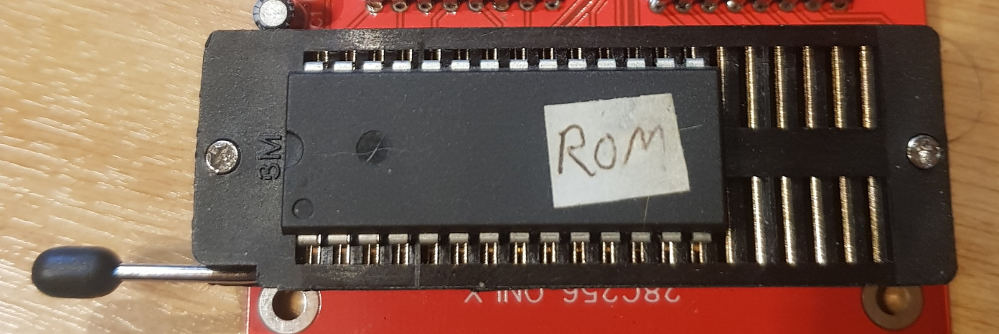
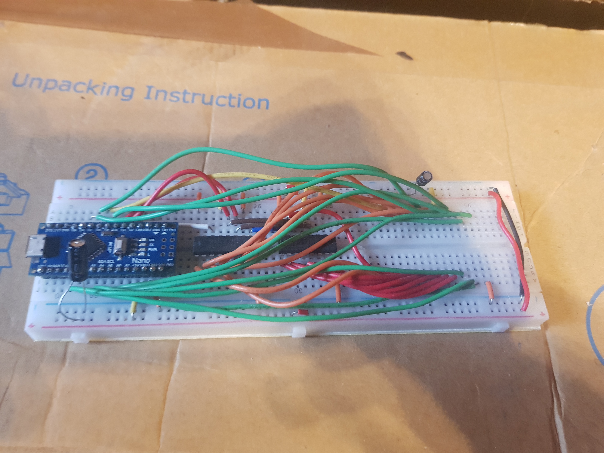

# EEPROMWriter
Arduino-based programmer for the 28c256 32KB EEPROM  

## Building
You can order a PCB using the gerber files in the PCB directory. The EasyEDA source file is also there if you want to modify the PCB.  
Alternatively, you can build it on a breadboard, using the EasyEDA schematic as a guide.

## Setup
First, the EEPROMWriter3 software must be flashed onto the Arduino.  
This can be done by opening `EEPROMWriter3.ino` in the Arduino software and clicking "Upload".  
The computer-side software is made in [Python 3](https://www.python.org/), so make sure that's installed.  
The pyserial library is also required. Install it with `pip install pyserial`.

## Usage
The EEPROM chip goes into the socket closest to the lever, with the chip's notch facing the lever, like so:  
  
The software can be run from command-line using `python WriteEEPROM.py`.  
On Windows, the COM port can be found in Device Manager, under the "Ports" section.
Arg 1 = COM port of EEPROM Arduino (usually COM3)
Arg 2 = R, W, V (read, write or verify)
Arg 3 = Name of file to read from or write to
Read will read the image from the EEPROM and save it to a file on your computer.  
Write will write the image from a file onto the EEPROM.  
Verify will compare the data on the EEPROM to a given file, and tell you if they match.  
Example: `python WriteEEPROM.py COM3 W image.bin`

## Future Plans
- Design a 3D-printable case
- Autodetection of the COM port
- Currently only supports writing 16KB of the 32KB rom, this can be fixed in software

## Parts List
- 1x Arduino Nano
- 2x 74HC595 Shift Registers
- 1x 40pin ZIF socket
- 1x 330Ω resistor (optional) - for LED
- 1x LED (optional) - activity LED
- 1x 1μF capacitor (optional) - bypass cap, for smoothing input voltage

## Pictures
<figure>
    
    <figcaption>Assembled PCB</figcaption>
</figure>
<figure>
    
    <figcaption>Breadboard Prototype</figcaption>
</figure>